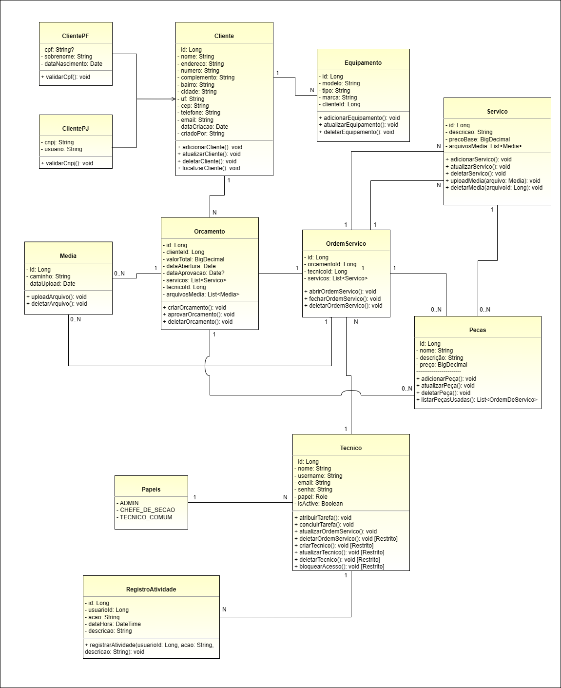

## Projeto de Sistema para uma Assitência Tecnica em Informática

Neste Projeto eu estou utilizando [Spring Initializr]([URL](https://start.spring.io/)) na **versão 3.3.4**, com **java 17** e **Maven**, optei por utilizar o **postgresql** como BD, e as dependências que estarei listando logo abaixo.

Primeiramente eu montei um UML para representar o que eu buscava como sistema, após isso eu montei a relação que cada classe representaria no sistema.



## Spring Initializr

**Spring Web:** Constrói aplicativos web, incluindo aqueles que seguem o estilo RESTful, usando o Spring MVC.
Utiliza o Apache Tomcat como o contêiner embutido padrão.

**Spring Security:** É um framework altamente personalizável para autenticação e controle de acesso em aplicativos Spring.
Permite configurar regras de segurança, autenticação de usuários e autorização de recursos.

**Spring Data JPA:** Facilita a persistência de dados em bancos de dados SQL usando a API de Persistência Java (JPA).
Integra-se com o Hibernate para mapeamento objeto-relacional.
PostgreSQL Driver:
É um driver JDBC e R2DBC que permite que programas Java se conectem a um banco de dados PostgreSQL usando código Java padrão, independente do banco de dados.

**Spring Boot DevTools:** Fornece reinicializações rápidas de aplicativos, LiveReload e configurações para melhorar a experiência de desenvolvimento.
Útil durante o desenvolvimento para evitar a necessidade de reiniciar manualmente o aplicativo após alterações no código.
Lombok:
É uma biblioteca de anotações Java que ajuda a reduzir o código boilerplate.
Gera automaticamente getters, setters, construtores e outros métodos com base nas anotações aplicadas às classes.

**PostgreSQL Driver SQL:** É um driver JDBC e R2DBC que permite que programas Java se conectem a um banco de dados PostgreSQL usando código Java padrão e independente de banco de dados.

## Dependências

As dependências Spring Boot Starter Validation, Apache Commons FileUpload e ``Spring Boot Starter Test`` não estão aparecendo para adicionar na interface do **Spring Initializr**. Por isso, eu as incluí manualmente no arquivo ``pom.xml``.

#### Spring Boot Starter Validation

Essa dependência fornece suporte para validação de dados (por exemplo, usando anotações como ``@Valid`` e ``@NotNull)``.

```
<dependency>
    <groupId>org.springframework.boot</groupId>
    <artifactId>spring-boot-starter-validation</artifactId>
</dependency>
```

#### Apache Commons FileUpload

Essa biblioteca é necessária para lidar com upload de arquivos.

```
<dependency>
    <groupId>commons-fileupload</groupId>
    <artifactId>commons-fileupload</artifactId>
    <version>1.4</version>
</dependency>
```

#### Spring Boot Starter Test

Essa dependência inclui bibliotecas de teste como JUnit, Mockito, e assertj, entre outras, para facilitar o desenvolvimento de testes unitários e de integração.

```
<dependency>
    <groupId>org.springframework.boot</groupId>
    <artifactId>spring-boot-starter-test</artifactId>
    <scope>test</scope>
</dependency>
```

## Estrutura de pastas e arquivos

# Estrutura de Pastas do Projeto

```plaintext
com.dzpinfo.projeto/
│
├── application/                   
│   ├── controller/                # Controladores REST que gerenciam as requisições HTTP.
│   │   ├── ClienteController.java
│   │   ├── EquipamentoController.java
│   │   ├── OrcamentoController.java
│   │   ├── OrdemServicoController.java
│   │   └── ServicoController.java
│   ├── dto/                       # Objetos de Transferência de Dados (DTOs) para comunicação entre camadas.
│   │   ├── ClienteDTO.java
│   │   ├── EquipamentoDTO.java
│   │   ├── OrcamentoDTO.java
│   │   └── ServicoDTO.java
│   ├── service/                   # Classes de serviço que contêm a lógica de negócios.
│   │   ├── ClienteService.java
│   │   ├── EquipamentoService.java
│   │   ├── OrcamentoService.java
│   │   ├── OrdemServicoService.java
│   │   └── ServicoService.java
│   └── mapper/                    # Classes responsáveis pela conversão entre entidades e DTOs.
│       ├── ClienteMapper.java
│       └── EquipamentoMapper.java
│
├── domain/                        # Contém as classes de domínio e entidades do sistema.
│   ├── entity/                    # Entidades que representam as tabelas do banco de dados.
│   │   ├── Cliente.java
│   │   ├── ClientePF.java
│   │   ├── ClientePJ.java
│   │   ├── Equipamento.java
│   │   ├── Orcamento.java
│   │   ├── OrdemServico.java
│   │   ├── Servico.java
│   │   ├── Tecnico.java
│   │   ├── Pecas.java
│   │   ├── Media.java
│   │   └── RegistroAtividade.java
│   ├── repository/                # Interfaces de repositório para acesso ao banco de dados.
│   │   ├── ClienteRepository.java
│   │   ├── EquipamentoRepository.java
│   │   ├── OrcamentoRepository.java
│   │   ├── OrdemServicoRepository.java
│   │   └── ServicoRepository.java
│   └── enums/                     # Enumerações usadas no domínio.
│       └── PapelUsuario.java
│
├── infrastructure/                # Contém implementações específicas da infraestrutura da aplicação.
│   ├── config/                    # Classes de configuração da aplicação.
│   │   ├── SecurityConfig.java
│   │   └── WebConfig.java
│   ├── exception/                 # Classes de exceção personalizadas.
│   │   ├── ResourceNotFoundException.java
│   │   └── ValidationException.java
│   ├── persistence/               # Classe para inicializar o banco de dados.
│   │   └── DatabaseInitializer.java
│   └── utils/                     # Classes utilitárias.
│       ├── FileStorageUtil.java
│       └── MediaUtil.java
│
├── security/                      # Contém classes relacionadas à segurança da aplicação.
│   ├── jwt/                       # Classes para autenticação e validação de tokens JWT.
│   │   ├── JwtAuthenticationFilter.java
│   │   ├── JwtTokenProvider.java
│   │   └── JwtTokenValidator.java
│   └── service/                   # Serviço que fornece detalhes do usuário para autenticação.
│       └── CustomUserDetailsService.java
│
└── ProjetoApplication.java        # Classe principal que inicia a aplicação Spring Boot.
```

## Criação do BD

Após se logar no ``SQL shell``, para criar o a tabela do banco de dados você deverá colocar o seguinte comando:

```
CREATE DATABASE MyBD;
```

## Configuração do arquivo ``application.properties``

```
spring.application.name=projeto
spring.datasource.url=jdbc:postgresql://localhost:5432/mybd
spring.datasource.username=postgres
spring.datasource.password=senha
spring.jpa.hibernate.ddl-auto=update
spring.jpa.show-sql=true
```

## teste

